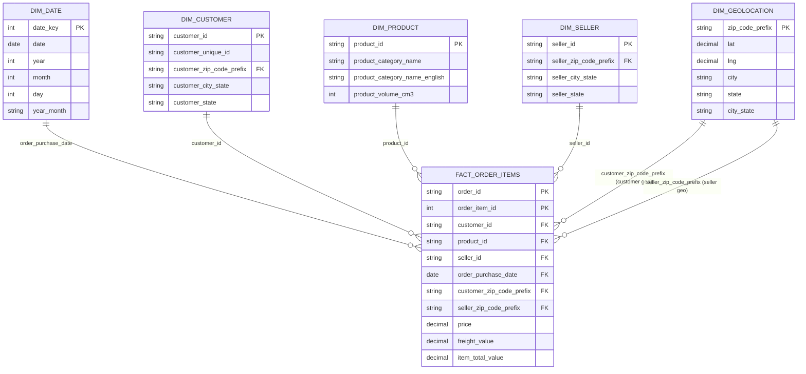

# Data Mart 레이어

```
Data Mart는 Data Warehouse 또는 통합 정제 영역을 기반으로 
특정 분석 목적에 맞추어 데이터를 재구성한 분석 전용 저장소입니다.
DM의 주요 목적은 분석/대시보드 사용자의 조회 편의성과 성능을 우선하는 것입니다.

본 프로젝트는 raw -> stg -> dm의 레이어 구조를 사용합니다. 
여기서 stg는 원천 데이터를 정제하고 조인 가능한 형태로 표준화하는 
통합 정제 영역 역할을 수행하며,
dm 레이어는 stg 데이터를 분석 목적에 맞게 재구성하는 최종 분석 레이어입니다.

본 프로젝트의 레이어 역할은 다음과 같이 구분됩니다.

- Raw 레이어
	- 원본 데이터를 가능한 변형 없이 적재/보관한 영역

- Staging 레이어
    - 타입 변환, 문자열 표준화(TRIM/대소문자), 날짜 파싱 등 정제 작업을 수행
    - PK/FK 기반 조인 안전성을 점검하고, 정합성 위반을 삭제 대신 플래그 컬럼으로 관리
    - 결과적으로 조인 가능한 표준 데이터를 저장한 영역

- Data Mart 레이어
    - 분석 목적에 맞추어 데이터를 재구성한 영역
    - Fact-Dimension 구조를 적용하여 분석 단위를 고정하고, 
      KPI 계산을 단순화하여 분석 및 대시보드 구축을 용이하게 함

따라서 본 프로젝트에서 Data mart 레이어는 Staging 레이어의 데이터를 분석 목적에 맞게 
Fact/Dimension 구조로 재구성하여, 
일관된 KPI 산출과 BI 도구 기반 분석을 가능하게 합니다.
또한, 이후 코호트 분석, KPI 시계열 분석, 주문 취소율 기반 거래 안정성 점검과 같은
Analysis Module의 데이터 기반으로 활용됩니다.

본 프로젝트에서 Data Mart 레이어의 주요 역할은 다음과 같습니다.

- KPI 집계 단순화
- 분석 단위(Grain) 고정
- 비즈니스 정의의 일관성 확보
- BI 도구 친화적 구조 제공
```


---

## 1. Data Mart 설계


## 1.1 Data Mart 설계 목적


```
본 프로젝트에서 Data Mart 설계의 목적은
Staging 레이어에서 정제된 데이터를 기반으로, 분석과 대시보드 구축에
즉시 활용 가능한 구조를 제공하는 것입니다.

이를 위해 Data Mart의 설계 목표는 다음과 같습니다.

- 분석 단위의 명확화
- KPI 정의의 일관성 확보
- 분석 및 대시보드 구현의 단순화
- 확장성과 유지보수 고려
```

- **분석 단위의 명확화**
	- 분석 대상이 되는 Fact 테이블의 Grain을 사전에 고정
	- 중복 집계나 데이터 폭발과 같은 오류를 방지


- **KPI 정의의 일관성 확보**
	- 동일한 KPI가 분석자나 대시보드에 따라 다르게 계산되는 문제를 예방
	- KPI 계산 기준을 Data Mart 단계에서 명확히 함

- **분석 및 대시보드 구현의 단순화**
	- 복잡한 다중 조인 없이도 KPI 집계가 가능하도록 설계
	- Fact-Dimension 구조를 적용

- **확장성과 유지보수 고려**
	- 향후 분석 주제 확장이나 집계 테이블 추가를 고려
	- 기존 구조를 크게 변경하지 않도록 설계


### 1.2 Data Mart 설계 전략


```
본 프로젝트에서는 분석 목적에 따라 Data Mart를 두 개로 분리하여 설계합니다.

- Sales Data Mart
- Operations Data Mart
  
이와 같이 Data Mart를 분리한 이유는 다음과 같습니다.

- 매출 분석과 운영 분석은 분석 관점과 주요 KPI가 명확히 다르기 때문
  
- 하나의 Data Mart에 모든 목적을 포함할 경우,
  Fact 테이블의 Grain이 모호해지고 설계 복잡도가 증가할 수 있기 때문
  
- 목적별 Data Mart 분리를 통해, 각 분석 주제에 최적화된 Fact 구조와 KPI 정의를 유지하기 위함
  
각 Data Mart는 공통적으로 Star Schema(Fact-Dimension 구조)를 채택합니다.

또한 날짜, 지역과 같이 여러 Data Mart에서 공통적으로 사용되는 Dimension은
Conformed Dimension 형태로 설계하여,
Data Mart 간 분석 결과의 일관성을 유지하도록 합니다.
```

- **Data Mart 분리**
	- Sales Data Mart
		- 매출, 상품, 판매자, 지역, 기간 기준의 성과 분석 목적
	- Operations Data Mart
		- 주문 상태, 배송 리드타임, 지연 여부 등 운영 관점 분석 목적

- **Star Schema 채택**
	- Fact 테이블에는 매출 금액, 수량, 리드타임 등 측정값에 집중
	- Dimension 테이블에는 날짜, 상품, 고객, 판매자, 지역 등 분석 기준 속성을 분리하여 관리
	- 이를 통해 BI 도구에서 직관적인 분석 축 구성과 빠른 집계를 가능하게 함


### 1.3 Data Mart 설계 기준 및 원칙


```
본 프로젝트의 Data Mart는 이후 코호트 분석, KPI 시계열 분석, 
주문 취소율 기반 거래 안정성 점검과 같은 분석 모듈의 안정적인 데이터 기반이 되도록 
설계 기준과 원칙을 명확히 정의합니다.

Data Mart 설계 시 다음 기준과 원칙을 공통적으로 적용합니다.

- Fact / Dimension 분리 기준

- 분석 단위(Grain) 정의 원칙

- 중복 방지 설계

- KPI 정의 위치에 대한 원칙

- 확장성 및 재사용성 고려
```

- **Fact / Dimension 분리 기준**
	- Star Schema 구조를 기반으로 측정값과 분석 기준 속성을 명확히 분리
	- Fact 테이블은 매출 금액, 수량, 리드타임 등 측정값에 집중
	- Dimension 테이블은 날짜, 고객, 상품, 판매자, 지역 등 분석 기준 속성을 관리
	- 이를 통해 집계 대상과 분석 축의 역할을 명확히 구분

- **분석 단위(Grain) 정의 원칙**
	- Fact 테이블의 1행이 의미하는 비즈니스 이벤트를 명확히 정의
	- Data Mart 설계 단계에서 Grain을 고정하고 문서화
	- 서로 다른 Grain을 갖는 데이터는 하나의 Fact 테이블에 혼합하지 않음
	- 이를 통해 중복 집계 및 해석 오류 방지

- **중복 방지 설계**
	- 주문, 결제, 리뷰 등 1:N 관계가 존재하는 데이터 구조를 고려
	- 주문 상품 단위 Fact에 결제/리뷰 데이터를 직접 조인하지 않음
	- 주문당 다건 발생 가능한 데이터는
		- 별도의 Fact 테이블로 분리하거나
		- 사전 집계된 형태로만 결합
	- Data Mart 단계에서 조인 방향과 허용 관계를 명확히 정의

- **KPI 정의 위치에 대한 원칙**
	- 계산 기준이 고정되고 반복적으로 사용되는 KPI는 Data Mart 단계에서 정의
		- 예: 매출, 주문 수, 취소율 등
	- 분석 목적에 따라 계산 방식이 달라질 수 있는 지표는 Analysis Module에서 계산
		- 예: 코호트 리텐션, 누적 성장률, 조건 기반 파생 지표
	- 이를 통해 Data Mart는 안정적인 기준 데이터 제공 역할을 수행

- **확장성 및 재사용성 고려**
	- 향후 분석 주제 확장을 고려하여 Fact / Dimension 구조를 재사용 가능하도록 설계
	- 대시보드 성능 개선이 필요한 경우 집계 테이블을 추가하는 방식으로 대응
	- 날짜, 지역과 같이 여러 Data Mart에서 공통으로 사용하는 Dimension은 Conformed Dimension으로 설계하여 분석 결과의 일관성을 유지


---


## 2. Sales Data Mart


```
Sales Data Mart는 매출을 상품, 판매자, 지역, 기간 기준으로 분석하기 위한
분석 전용 Data Mart입니다.

매출 관련 KPI를 안정적으로 산출하고,
BI 도구에서 복잡한 조인 없이 분석이 가능하도록 설계하는 것을 주요 목적으로 합니다.

Sales Data Mart의 Main Fact 테이블은
주문-상품 단위(order_id, order_item_id)를 Grain으로 합니다.

Sales Data Mart의 Fact 테이블 Grain 규칙은 아래와 같습니다.

- Fact 테이블의 1행은 하나의 주문에 포함된 개별 상품 1건을 의미
- 상품, 카테고리, 판매자 단위 매출 분석을 지원
- 주문 단위 KPI(주문 수, 객단가 등)는 상위 집계로 확장 가능
- 서로 다른 Grain을 하나의 Fact 테이블에 혼합하지 않음

Sales Data Mart는 하나의 메인 Fact 테이블과 여러 Dimension 테이블로 구성된
Star Schema 구조를 사용합니다.

Fact-Dimension 목록은 아래와 같습니다.

- Fact
	- fact_order_items

- Dimension
	- dim_date
	- dim_product
	- dim_seller
	- dim_customer
	- dim_geolocation

주요 KPI와의 매핑은 아래와 같습니다.

- 총 매출(GMV): SUM(item_total_value)
- 주문 상품 수: COUNT(*)
- 주문 수: COUNT(DISTINCT order_id)
- 평균 주문 상품 금액: AVG(item_total_value)
- 평균 배송비: AVG(freight_value)
- 카테고리별 매출: GROUP BY product_category_name
- 지역별 매출(고객/판매자): GROUP BY dim_geolocation.city_state  


참고: ERD의 컬럼 타입은 논리적 타입 기준으로 표기하였으며, 
     실제 물리 타입은 데이터 명세 문서에서 별도로 관리합니다.
```

- **Fact**
	- fact_order_items
		- 주문-상품 단위의 매출 분석을 위한 메인 Fact 테이블
		- 매출 금액, 배송비 등 측정값을 포함

- **Dimension**
	- dim_date
		- 매출 시계열 분석을 위한 날짜 기준 Dimension
	- dim_product
		- 상품 및 카테고리 기준 분석을 위한 Dimension
	- dim_seller
		- 판매자 성과 분석을 위한 Dimension
	- dim_customer
		- 고객 단위 분석 및 코호트 분석을 위한 Dimension
	- dim_geolocation
		- 지역(state/city) 기준 분석을 위한 Dimension


- **ERD**



---


## 3. Operations Data Mart


```
Operations Data Mart는 주문 처리 과정의 운영 관점 지표를 분석하기 위한
분석 전용 Data Mart입니다.

주문 상태(order_status), 배송 리드타임, 배송 지연 여부 등
거래 안정성과 운영 품질을 점검할 수 있는 KPI를
일관된 기준으로 산출하는 것을 주요 목적으로 합니다.

Operations Data Mart의 Main Fact 테이블은
주문 단위(order_id)를 Grain으로 합니다.

Operations Data Mart의 Fact 테이블 Grain 규칙은 아래와 같습니다.

- Fact 테이블의 1행은 주문 1건(order_id)과 1:1로 대응
- 주문 상태 변화 및 배송 프로세스의 시점 데이터를 기반으로 운영 KPI를 산출
- 주문 취소율/미배송율/지연율 등 거래 안정성 점검 분석을 지원
- 주문-상품 단위와 같은 다른 Grain과 혼합하지 않음

Operations Data Mart는 하나의 메인 Fact 테이블과 여러 Dimensions 테이블로 구성된
Star Schema 구조를 사용합니다.

Fact-Dimension 목록은 아래와 같습니다.

- Fact
    - fact_orders

- Dimension
	- dim_date
	- dim_customer
	- dim_geolocation

주요 KPI와의 매핑은 아래와 같습니다.

- 주문 수: COUNT(*)
- 취소율: SUM(is_canceled) / COUNT(*)
- 미배송(불가용) 비율: SUM(is_unavailable) / COUNT(*)
- 정상 완료율: SUM(is_delivered) / COUNT(*)
- 평균 승인 리드타임: AVG(approve_lead_time_days)
- 평균 배송 리드타임: AVG(delivery_lead_time_days)
- 배송 지연율: SUM(is_delayed) / COUNT(*)

참고: ERD의 컬럼 타입은 논리적 타입 기준으로 표기하였으며, 
     실제 물리 타입은 데이터 명세 문서에서 별도로 관리합니다.
```

- **Fact**
	- fact_orders
		- 주문 단위 운영 지표 분석을 위한 메인 Fact 테이블
		- 주문 상태, 주요 시점(구매/승인/배송 시작/배송 완료/예상 배송일) 및 파생 리드타임/지연 플래그를 포함

- **Dimension**
	- dim_date
		- 주문 시계열 분석을 위한 날짜 기준 Dimension (Conformed Dimension)
	- dim_customer
		- 고객 단위 운영 지표 분석 및 코호트 분석 확장을 위한 Dimension (Conformed Dimension)
	- dim_geolocation
		- 고객 지역 기반 운영 지표 분석을 위한 Dimension (Conformed Dimension)

- **ERD**


