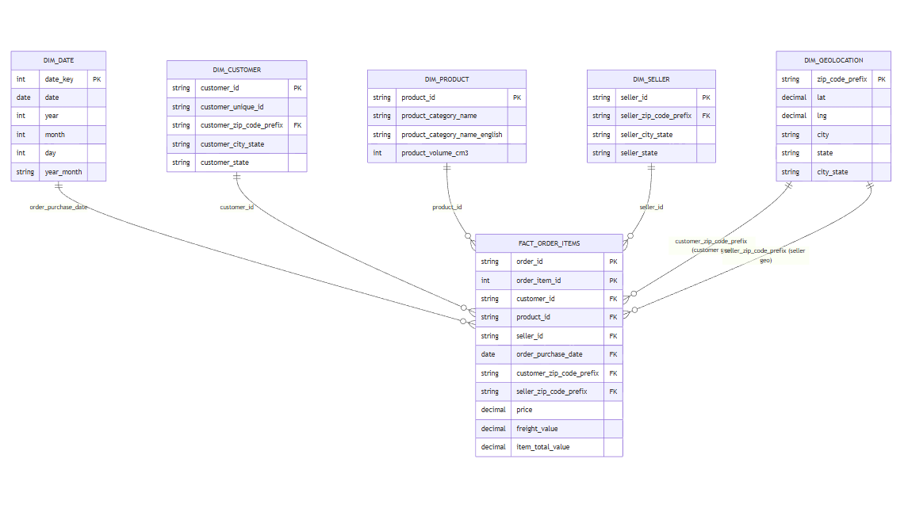
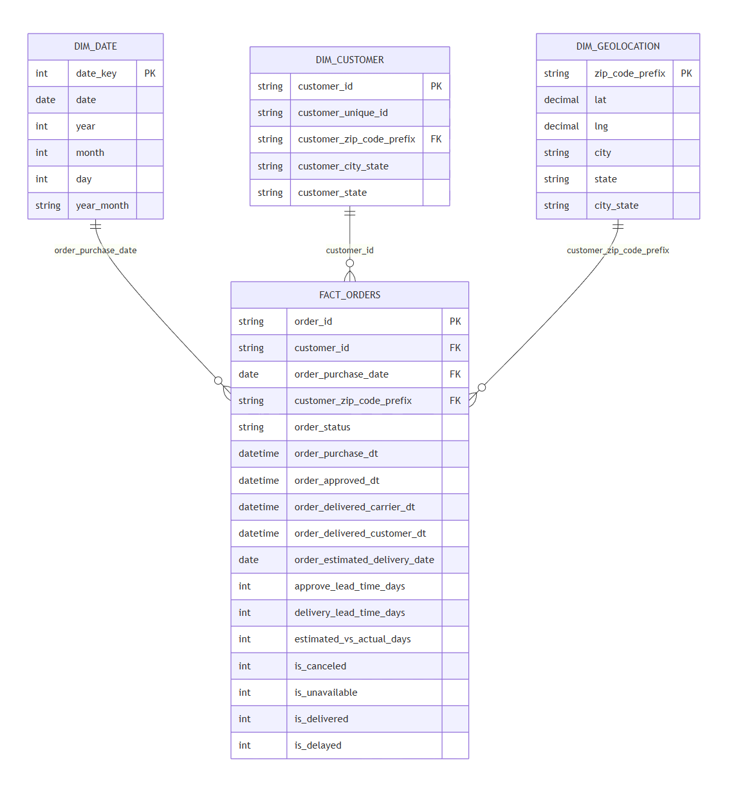
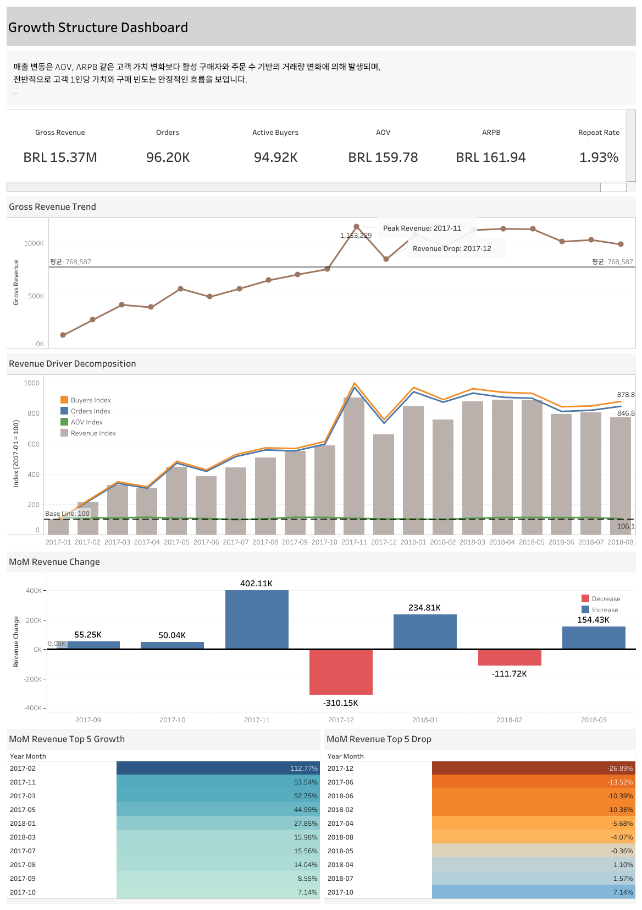
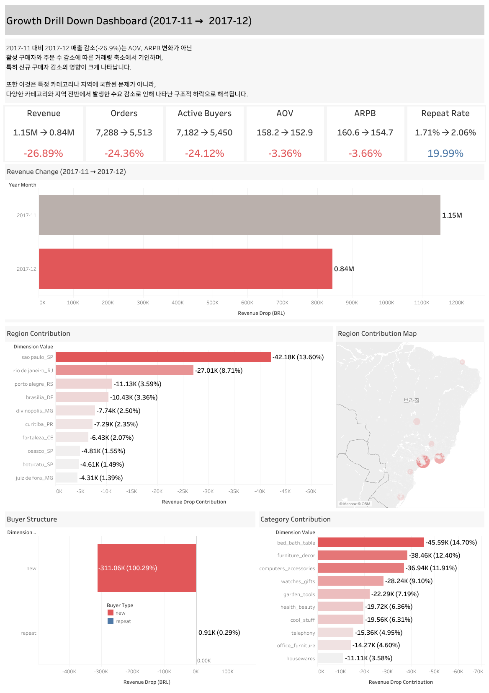
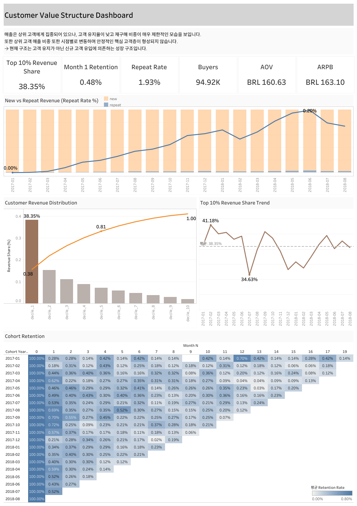
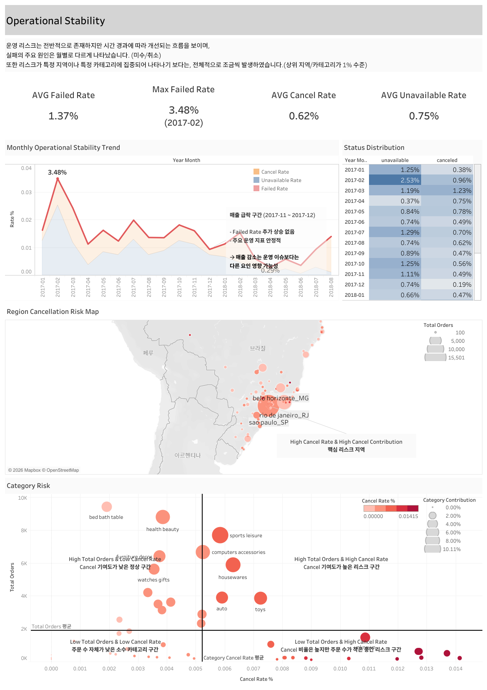

# Olist SQL Data Service


```
본 프로젝트는 e-commerce 플랫폼의 매출 변동 원인을 구조적으로 분석합니다.

Raw → Staging → Data Mart → Analytics Layer까지 데이터 환경을 설계하고,
BI 레이어 및 Tableau 대시보드를 구축하여 분석 결과를 시각화하였습니다.

핵심 분석 결과는 다음과 같습니다.

- 매출 급락 원인: 신규 고객 유입 감소
  
- 성장 구조: 고객 가치 상승이 아닌 거래량(특히 신규 구매자) 기반
  
- 핵심 문제: acquisition 중심 구조로 인한 매출 변동성
  
- 결론: 매출 감소는 운영 문제가 아닌 수요 축소 문제
  
- 해결 방향: Acquisition Funnel 최적화 + Retention 전략 강화


분석에서 사용한 도구는 아래와 같습니다.

- 데이터 환경 설계 및 분석: MySQL
- 대시보드: Tableau
```

- **Growth Structure**
	- 매출 변동의 KPI 구조 분해 (Revenue = Buyers x Orders x AOV)
	→ [View SQL](./04_sql/05_analysis/01_adhoc_growth_structure.sql)

- **Growth Drill Down**
	- 2017-11 → 2017-12 급락 구간 원인 분석
	→ [View SQL](./04_sql/05_analysis/02_adhoc_growth_drill_down.sql)

- **Customer Value Structure**
	- 고객 가치 구조 및 분포/집중도 분석
	→ [View SQL](./04_sql/05_analysis/03_customer_value_structure.sql)

- **Operational Stability**
	- 주문 상태 기반 거래 안정성 분석
	→ [View SQL](./04_sql/05_analysis/04_adhoc_operational_stability.sql)

- **Tableau Dashboard**
	→ [View Dashboard PDF](./03_dashboard/00_Dashboard_Tableau.pdf)


---

## Project 개요


본 프로젝트는 브라질 이커머스 플랫폼(Olist)의 거래 데이터를 기반으로
매출 성장 및 감소의 구조적 원인을 분석하고,
플랫폼의 성장 방식과 고객 구조를 진단하는 것을 목표로 합니다.

분석은 단순 지표 확인이 아닌, 매출을 구성하는 핵심 요소를 분해하여
비즈니스 관점에서의 의사결정 인사이트 도출에 초점을 두었습니다.

전체 분석은 다음 4가지 모듈로 구성됩니다.

- Growth Structure: 매출 성장 구조 분석
- Growth Drill Down: 매출 급락 원인 분석 (2017-11 -> 2017-12)
- Customer Value Structure: 고객 기반 매출 구조 분석
- Operational Stability: 운영 리스크 및 안정성 분석

각 분석에서의 핵심 결론은 다음과 같습니다.

- 매출은 고객 가치 상승이 아닌 거래량(구매자 수, 주문 수) 중심으로 성장 및 하락
- 매출 급락은 운영 문제가 아닌 신규 고객 유입 감소에 의해 발생
- 플랫폼은 재구매보다 신규 고객 유입에 의존하며, VIP 고객(상위 10%) 역시 매달 바뀌는 구조
- 운영 안정성은 전반적으로 유지되며, 매출 변동과 직접적인 연관성은 낮음

따라서 지속적인 성장을 위해서는 신규 유입 중심 구조에서 벗어나 
고객 유지(리텐션) 전략 강화와 충성 고객 확보가 핵심 과제로 판단됩니다.


관련 문서: [View Docs](./01_docs/Analysis_Plan.md)


---

## 데이터 Source


본 프로젝트는 브라질 이커머스 플랫폼 Olist의 공개 데이터를 활용하여 진행되었습니다.

- Dataset: Brazilian E-Commerce Public Dataset by Olist
- 출처: Kaggle (https://www.kaggle.com/datasets/olistbr/brazilian-ecommerce)
- 원천 데이터 기간: 2016-09 ~ 2020-04
- 분석 활용 기간: 2017-01 ~ 2018-08 (이상치 및 거래량 왜곡 구간 제외)

해당 데이터는 이커머스 플랫폼의 주문 단위 트랜잭션 데이터를 중심으로
고객, 상품, 판매자, 결제, 리뷰 등 다양한 차원 정보를 포함하고 있습니다.

주요 테이블은 다음과 같습니다.

- orders: 주문 정보 (주문 상태, 주문 일자 등)
- order_items: 주문 상품 정보 (상품, 가격 등)
- customers: 고객 정보
- products: 상품 정보 (카테고리 등)
- sellers: 판매자 정보
- order_payments: 결제 정보
- order_reviews: 리뷰 정보
- geolocation: 지역 정보 (위치 기반 분석 활용)
  
분석에서 활용한 데이터의 참고사항은 다음과 같습니다.

- 일부 기간(2016년, 2018-09 이후)은 거래량이 매우 적어 분석에서 제외
- 주문 상태(order_status)에 따라 분석 기준을 구분하여 사용
	  - 매출/고객 분석: Delivered 주문 기준
	  - 운영 안정성 분석: 전체 주문 기준
- 공개 데이터 특성상 실제 비즈니스 맥락은 제한적으로 해석


---

## Problem Statement


이커머스 플랫폼의 매출은 단순한 증가/감소 수치만으로는 그 원인을 명확히 설명하기 어렵습니다.
매출은 구매자 수, 주문 수, 고객 가치, 운영 안정성 등 다양한 요소가
복합적으로 작용한 결과이기 때문입니다.

특히, 단기적인 매출 급등 또는 급락이 발생하는 경우,
이는 단순한 수요 변동인지, 고객 구조 변화인지, 혹은 운영 문제에 의한 것인지 
구분하는 것이 중요합니다.

본 프로젝트는 이러한 문제 인식을 바탕으로,
이커머스 플랫폼의 매출 변동을 구조적으로 분해하고 원인을 진단하는 것을 목표로 합니다.

주요 질문은 다음과 같습니다.

- 매출은 거래량과 고객 가치 상승, 운영 안정성 중 어떤 것에 의해 결정되는가?
- 매출 급락의 원인은 무엇인가?
- 플랫폼의 매출 구조는 어떻게 되는가?
- 고객 가치는 매출 변화에 얼마나 기여하는가?
- 운영 안정성은 매출에 어떤 영향을 미치는가?

이를 위한 핵심 분석은 다음과 같습니다.

- 매출을 구성하는 핵심 요소를 분해하여 성장 구조를 정량적으로 분석
- 특정 기간의 급격한 매출 변화에 대해 구조적 원인 분석 수행
- 고객 가치 및 분포 분석을 통해 매출의 고객 기반 구조 진단
- 운영 안정성 지표를 통해 비즈니스 리스크 요인 검증
- 최종적으로 데이터 기반의 비즈니스 의사결정 인사이트 도출


---

## Analysis Flow


본 프로젝트는 단순 지표 분석이 아닌,
매출을 구성하는 요소를 단계적으로 분해하여
성장 구조 -> 원인 분석 -> 고객 구조 -> 운영 영향 검증의 흐름으로 진행되었습니다.

전체 분석은 다음 4단계로 구성됩니다.

1. **Growth Structure**
	
	- 월별 KPI를 기반으로 전체 매출 성장 흐름을 분석
	- 매출 변동을 구매자수 / 주문 수 / 고객 가치로 분해하여 주요 성장 요인을 식별
	- 매출 급등 및 급락 구간을 탐지하여 추가 분석이 필요한 핵심 구간 정의

2. **Growth Drill Down**
	
	- 매출 급락 구간(2017-11 -> 2017-12)을 대상으로 구조적 원인을 상세 분석
	- 카테고리, 지역, 신규/재구매 구조를 기준으로 매출 감소 기여도를 분해
	- 특정 요인에 집중된 문제인지, 전반적인 수요 감소인지 판단

3. **Customer Value Structure**
	
	- 고객 단위 KPI(ARPB, 주문 빈도, AOV)를 분석하여 매출의 고객 기반 구조를 진단
	- 고객 분포, 상위 고객 집중도, 신규 vs 재구매 구조 분석
	- 코호트 리텐션 분석을 통해 고객 유지 패턴 및 장기 가치 검증

4. **Operational Stability**
	
	- 주문 상태(cancel, unavailable)를 기반으로 운영 안정성 지표 분석
	- 월별 안정성 추이 및 이상 구간 탐지
	- 카테고리 및 지역별 리스크 분포 분석
	  


---

## KPI Definition


본 프로젝트에서는 이커머스 매출 구조를 분석하기 위해
다음과 같은 핵심 KPI를 정의하고 활용하였습니다.

- **Core KPI**
	- Gross Revenue
		- 총 매출 금액 (주문 완료 기준 합계)
		- Delivered 주문을 기준으로 계산
	
	- Orders
		- 총 주문 수
		- Delivered 주문 기준
	
	- Active Buyers
		- 해당 월에 구매를 발생시킨 고객 수 (고유 고객 기준)

- **Customer Value KPI**
	- AOV (Average Order Value)
		- 평균 주문 금액
		- AOV = Revenue / Orders
	
	- ARPB (Average Revenue Per Buyer)
		- 고객 1인당 평균 매출
		- ARPB = Revenue / Active Buyers
	
	- Orders per Buyer
		- 고객 1인당 평균 주문 수
		- Orders per Buyer = Orders / Active Buyers

- **Retention KPI**
	- Repeat Rate
		- 재구매 고객 비율
		- Repeat Rate = Repeat Buyers / Active Buyers
	
	- Cohort Retention
		- 특정 시점에 유입된 고객이 이후에도 유지되는 비율
		- 고객 유지 및 장기 가치 평가에 활용

- **Operational KPI**
	- Cancel Rate
		- 주문 취소 비율
	
	- Unavailable Rate
		- 재고/배송 문제로 인한 미처리 비율
	
	- Failed Rate
		- 취소와 미처리를 합한 주문 실패 비율


관련 문서: [View Docs](./01_docs/KPI_Definition.md)

---

## Data Architecture


본 프로젝트는 단순 분석을 넘어,
지속적으로 재사용 가능한 분석 환경을 구축하기 위해
데이터 레이어를 단계적으로 설계하였습니다.
(Raw Layer -> Staging -> Data Mart -> Analytics -> BI)

전체 구조는 다음과 같은 4단계로 구성되고, 추가로 BI Layer를 추가하였습니다.
(BI Layer는 대시보드용 데이터 레이어로 필수 레이어는 아닙니다.)

1. **Raw Layer**
	- 원본 데이터를 적재하는 단계
	- 정제 및 전처리를 일절 하지 않음
	- 있는 그대로 적재

2. **Staging Layer**
	- 원본 데이터를 정제 및 전처리하는 단계
	- 테이블 간 Join을 통해 분석에 필요한 기본 구조 생성
	- 데이터 타입 정리 및 결측치 처리 수행

3. **Data Mart Layer**
	- 분석 목적에 맞게 Fact / Dimension 구조로 데이터 모델링
	- 주요 테이블 구성:
		- Fact Table
			- fact_orders: 주문 단위 데이터
			- fact_order_items: 주문 상품 단위 데이터
		
		- Dimension Table
			- dim_customer, dim_product, dim_seller, dim_date 등

4. **Analytics Layer**
	- KPI 계산 및 분석을 위한 View 생성
	- 주요 View:
		- vw_kpi_monthly_core: 월별 핵심 KPI
		- vw_base_customer_monthly_purchase: 고객 단위 월별 구매 데이터
		- vw_customer_first_purchase_month: 고객 최초 구매 기준 데이터


관련 문서:[View Docs (raw/stg./dm)](./01_docs/Data_Specification.md) / [View Docs (dm 설계)](./01_docs/Data_mart_design.md) / [View Docs (am)](./01_docs/Analytics_Module.md)








---

## Key Findings


본 프로젝트에서는 매출 구조, 고객 구성, 운영 안정성을 중심으로 
이커머스 플랫폼의 성장 및 하락 원인을 분석하였습니다.

1. **Growth Structure: 매출 성장은 고객 가치 상승이 아닌 거래량 확대에 의해 발생**
	
	- 2017년 초부터 2017년 11월까지 매출은 약 9배 이상 성장
	- 매출 증가의 주요 원인은 구매자 수(Active Buyers)와 주문 수(Orders) 증가
	- AOV, ARPB는 전체 기간 동안 큰 변동 없이 안정적인 수준 유지

2. **Growth Drill Down(2017-11 -> 2017-12): 매출 급락은 신규 유입 감소에 따른 거래량 축소**
	
	- 2017-11에서 2017-12 구간에서 매출 -26.9% 급락
	- Orders(-24.36%), Active Buyers(-24.12%)가 유사한 수준으로 감소
	- AOV(-3.36%), ARPB(-3.66%)는 상대적으로 안정적
	- 카테고리 및 지역 분석 결과, 특정 요인이 아닌 전반적인 수요 감소로 나타남
	- 신규 고객 감소가 매출 하락에 가장 큰 영향을 미침

3. **Customer Value Structure: 플랫폼은 유입 중심의 성장 구조**
	
	- Repeat Rate는 약 1~3% 수준으로 매우 낮음
	- Cohort Retention 역시 1% 미만으로 매우 낮음
	- 매출은 기존 고객 유지보다 신규 고객 유입에 크게 의존
	- ARPB, AOV는 안정적인 수준 유지
	- 고객 가치 상승보다는 사용자 확장 중심의 성장 구조
	- Top 10% 고객 매출 비중은 약 35~40% 수준으로 유지 -> 과도한 상위 고객 의존 구조 아님

4. **Operational Stability: 매출 변동은 운영 문제보다는 수요 및 고객 구조 변화에 의해 발생**
	
	- Cancel / Unavailable / Failed(Cancel+Unavailable) Rate는 전반적으로 안정적
	- 시간 경과에 따라 일부 개선되는 흐름을 보임
	- 매출 급락 구간에서도 운영 지표의 이상 증가 없음

본 분석을 통해, 매출 변화의 핵심은 고객 유입 및 활성 기반임을 확인하였습니다.


관련 문서: [View Docs](./01_docs/Analysis_Insights.md)


---

## Insights & Action


본 분석을 통해 이커머스 플랫폼의 매출 구조와 성장 방식에 대한
다음과 같은 핵심 인사이트를 도출할 수 있습니다.

### Key Insights

1. **거래량 기반 성장 구조**
	- 매출은 AOV, ARPB와 같은 고객 가치 상승이 아닌 구매자 수와 주문 수 증가에 의해 결정됨
	- 즉, 플랫폼은 Volume 중심 성장 모델을 가짐

2. **신규 고객 의존 구조**
	- 낮은 Repeat Rate(약 1~3%)로 인해 매출은 기존 고객 유지보다 신규 고객 유입에 크게 의존
	- 이는 장기적으로 성장 지속성에 리스크로 작용 가능

3. **매출 급락의 핵심 원인**
	- 2017-11 -> 2017-12 매출 감소는 특정 카테고리/지역 문제가 아닌
	  전반적인 수요 감소 및 신규 고객 감소에 의해 발생

4. **운영 안정성과 매출의 낮은 연관성**
	- Cancel, Unavailable Rate 등 운영 지표는 안정적인 수준을 유지
	- 매출 변동은 운영 문제가 아닌 수요 및 고객 구조 변화에 의해 발생


핵심 인사이트를 통한 구체적인 액션 플랜은 다음과 같습니다.

### Action Plan

1. **리텐션 전략 강화**
	- CRM 기반 재구매 유도 (쿠폰, 추천, 이메일 마케팅 등)
	- 고객 생애가치(LTV) 기반 마케팅 전략 도입
	- 반복 구매를 유도하는 상품/서비스 구조 설계

2. **신규 고객 유입 구조 분석**
	- 유입 채널별 성과 분석 (마케팅 채널, 시즌성 등)
	- 특정 시점(2017-11)의 급증 요인 및 이후 감소 원인 검증
	- 프로모션 의존 성장 여부 분석

3. **Volume 중심 성장 구조 개선**
	- 단순 사용자 증가가 아닌 고객당 가치(ARPB, AOV) 개선 전략 필요
	- Upsell / Cross-sell 전략 도입

4. **지속적인 모니터링 체계 구축**
	- 보조적으로 KPI 기반 대시보드를 통한 실시간 모니터링
	- 이상 구간 발생 시 Drill Down 분석 프로세스 적용


결론적으로 현재 플랫폼은 신규 고객 유입을 기반으로 빠르게 성장한 구조를 가지고 있으며,
고객 유지율이 낮아 장기적인 성장 안정성이 부족한 상태입니다.
따라서, 유입 중심 성장에서 리텐션 중심 구조로 전환하는 것이 핵심 과제입니다.


관련 문서: [View Docs](./01_docs/Key_Insights_Action_Plan.md)













